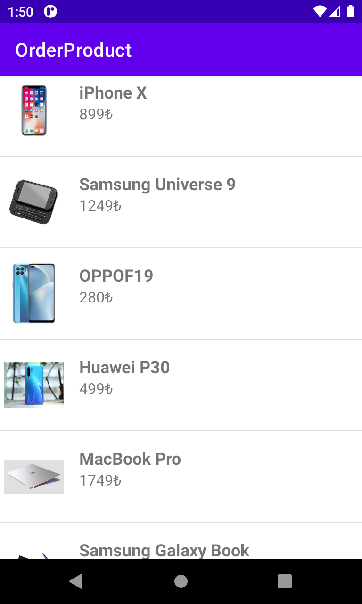
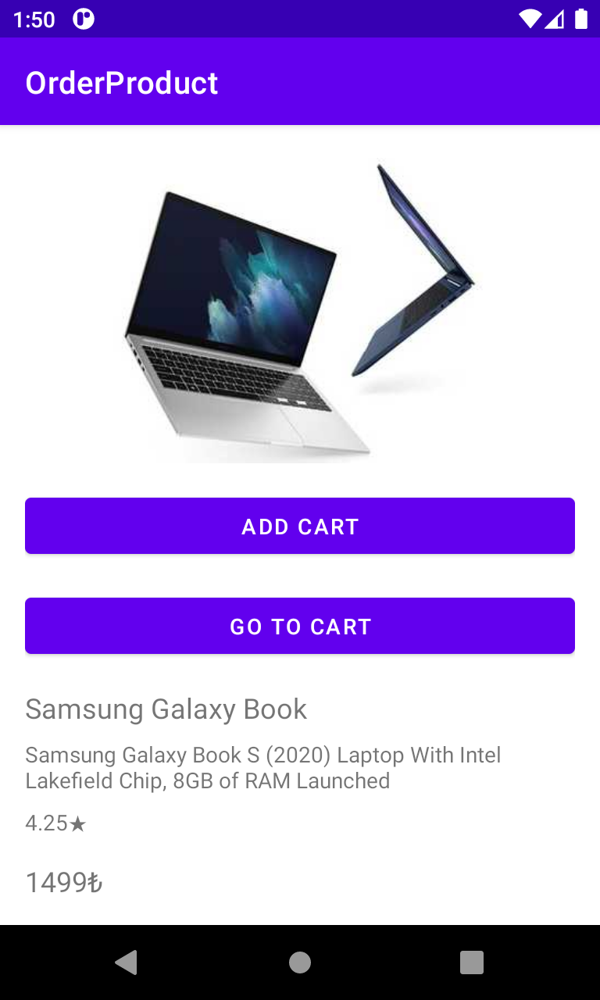

# Order Product Application
This repository demonstrates a product system application that utilizes an API client and JSON converter for managing product-related functionalities such as listing products, viewing product details, adding products to a cart, and navigating to the shopping cart.

The application is typically built using a programming language like Kotlin and incorporates libraries or frameworks that facilitate API communication and JSON data manipulation.

# Demo
- This application have add to cart, see details, and go to cart functionallities. It is developed from Product project, please check below images.

  
